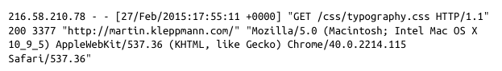
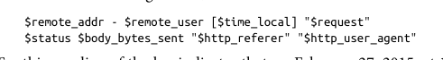
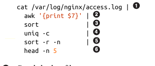
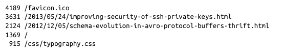
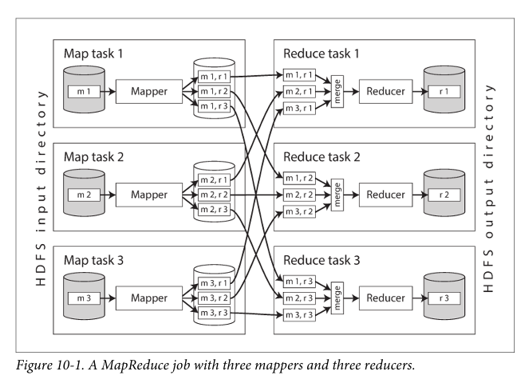
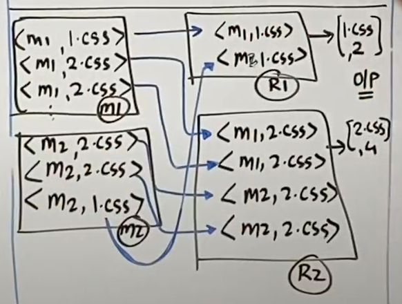
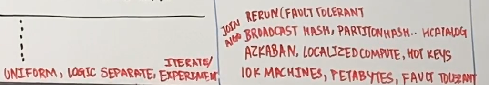
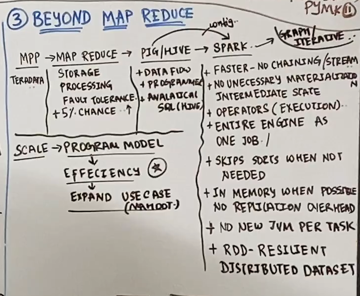

# Chapter-10 : Batch Processing

The modern data systems like database, caches, search, indexes, web servers and etc, data processing we send a request and queries as instruction and some time later system gives response as answers resp.

Online data systems

1. Web browser requesting a webpage
2. A service calling a remote api

response time of systems

www and https/rest api made request and response to build systems.

1. Services(online systems) : Response time is the primary measure of performance of the services and availability.
2. Batch Processing(Offline Systems) : It takes a large amount of data as input and runs a job to process it and produces output of data. these jobs take time thus batch jobs are often scheduled to run periodically. The primary measure of a batch job is throughput.
3. Stream Processing(Near-real-time Systems)

### Unix Batch processing :

### MapReduce and Distributed FileSystems

### Beyond MapReduce

